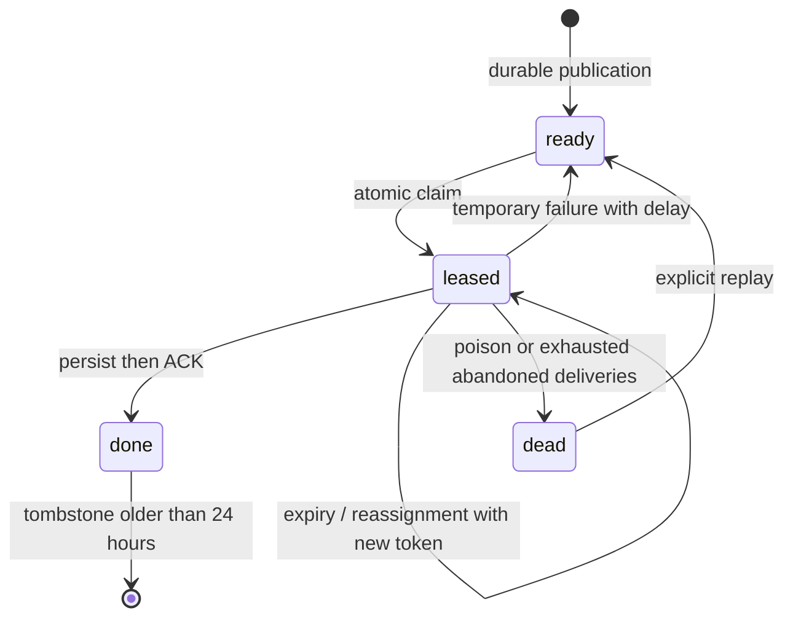

# Architecture and guarantees

## Boundaries

One Go module builds a role-based binary. Streamers publish raw CSV records with an envelope. Brokers own queue transitions. Collectors parse numeric telemetry, persist it, and then ACK through the broker. The public API reads stored telemetry. The migration command installs separate queue/telemetry schemas in one database.

PostgreSQL supplies transactions/row locks. Our code implements the messaging protocol, state transitions, identity, leases, retry classification, fencing, backpressure and cleanup. A database driver is not an existing MQ. The demonstration shares a database account; production should separate least-privilege roles.

## Identity and timestamps

New observations receive random 128-bit hex IDs. Producer session, loop and row provide provenance. Publication retries reuse the entire envelope. Later loops and other producers create new IDs even when metric values are equal.

The broker hashes canonical typed JSON with SHA-256. Same ID/payload returns success; same ID/different payload returns 409. Persistence checks that hash too. `processed_at` is assigned by PostgreSQL during the first insert that commits; redelivery preserves it. CSV timestamps remain source metadata. GPU listing metadata is first-seen; each observation also preserves its own source metadata.

## Queue states

Claims use short transactions and `FOR UPDATE SKIP LOCKED`. No database transaction remains open while a collector processes. Leases last 30 seconds; active processing renews every 5 seconds. Database time governs expiry. ACK/NACK/renew require the current unexpired token; an idempotent duplicate ACK may also match the saved completion token.

After five abandoned deliveries, an expired message becomes dead. Explicit dependency-failure NACKs reduce the just-consumed attempt and delay availability. Collector database preflight and backoff avoid immediate exhaustion during outages. If NACK cannot reach the broker, recovery depends on expiry; repeated process/network failures can still lead to retained dead letters. At most 100 exhausted leases are reclaimed per claim transaction.

Malformed records go directly to dead letters. Dead payloads count against capacity and are never automatically discarded. Successful messages release payload storage but keep identity/hash/receipt for at least 24 hours. Producers retry for at most one hour, then stop visibly. After tombstone expiry, broker acceptance deduplication no longer applies; persisted uniqueness continues while telemetry is retained. Never repurpose IDs.

## Failure contract

| Failure | Outcome |
|---|---|
| Publication commits, response is lost | Retry with same ID observes the committed record |
| Collector dies before persistence | Lease expires; another worker receives the event |
| Collector dies after persistence before ACK | Unique event ID prevents a second insert or timestamp change |
| Old worker resumes after reassignment | Old-token queue mutations fail; duplicate persistence remains safe |
| Broker pod disappears | Another broker accesses shared durable queue state |
| Database unavailable | Retryable errors, producer backoff, collector claim pause |
| Database restart with volume retained | Committed records survive and expired leases recover |
| Database volume lost | Requires backups/replication outside this single-instance demo |
| Producer dies before acceptance | Current in-memory observation has no durable outbox recovery |

At-least-once delivery attempts do not promise every payload processes successfully. Terminal outcomes are an acknowledged persisted event or retained dead letter. Durability depends on normal PostgreSQL commit settings and surviving storage.

## Bounds and scaling

One outstanding publish per streamer; fixed collector workers; bounded connection pools, body sizes (64 KiB), response pages and HTTP deadlines. Atomic capacity reservations enforce the outstanding limit across brokers. Identical retries succeed even at capacity. Queue-full responses use 429/Retry-After; publisher backoff has jitter and caps at 30 seconds.

The capacity counter is a deliberate serialization point. Queue/API traffic share a database. Additional brokers eventually stop improving throughput. Tombstones, indexes, cleanup throughput, autovacuum and disk usage need monitoring. Telemetry is retained indefinitely in v1; define retention and time partitioning before long-running production use. Cleanup is batched and never removes unfinished work.

Each streamer independently covers the complete CSV to increase simulated load. Real exclusive GPU ownership would need source partitioning/reassignment. Collectors compete, do not broadcast, and do not guarantee global processing order. The API sorts `(processed_at,event_id)` with indexed keyset pagination. It is a live view; late commits can require a repeated query. Repeatable exports need a snapshot/watermark design.

Replica scaling is supported on one or many nodes with no sticky sessions, broker-local state, fixed pod addresses or required anti-affinity. Single-node tests cannot validate node failure, multi-node throughput, or database HA. An external database is configurable; replication/failover is not implemented here.

## Internal protocol

JSON requests; optional bearer token on all queue endpoints. Internal errors are logged, not returned to callers.

| Endpoint | Input/result |
|---|---|
| `POST /queue/v1/publish` | Event envelope; returns `duplicate` boolean |
| `POST /queue/v1/claim` | Event, lease token/expiry, acceptance time, attempt; 204 if empty |
| `POST /queue/v1/ack` | `event_id` and `lease_token`; 204 |
| `POST /queue/v1/renew` | Same receipt; 204 |
| `POST /queue/v1/reject` | Receipt plus `permanent`, `reason`, `delay_ms` (0–30000); 204 |
| `GET /queue/v1/stats` | State counts and oldest active age |
| `GET /queue/v1/dead` | First 100 dead letters with payload and reason |
| `POST /queue/v1/dead/{id}/replay` | Reset a dead letter; 204 |

Reasons are bounded at 1,024 characters. Empty-queue polling waits 250 ms. Queue SQL lives in `internal/store`, protocol adapters in `internal/broker`, and application loops in `internal/worker`.

## Lifecycle

SIGTERM stops new work. Collectors drain claimed work with a 20-second processing deadline and bounded final NACK. The process allows 25 seconds for worker drain plus 5 seconds for HTTP shutdown; Kubernetes allows 40 seconds. Unfinished deliveries recover by lease expiry.

The initial schema migration is idempotent and guarded by an advisory transaction lock. Future schema changes require ordered/versioned migrations and rolling compatibility; editing a `CREATE TABLE IF NOT EXISTS` statement cannot upgrade existing columns.
